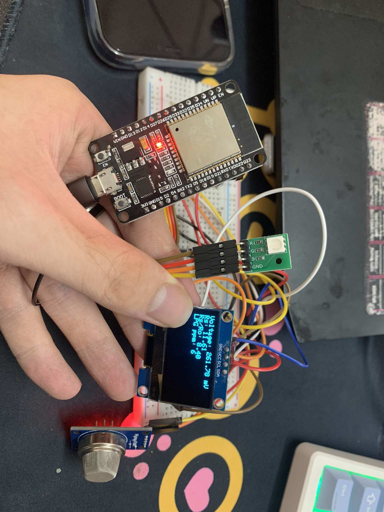
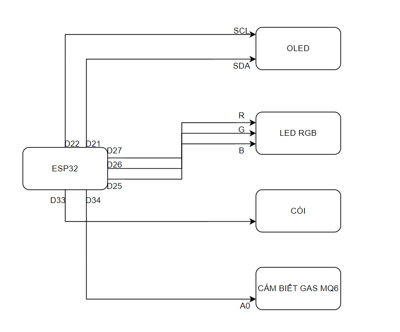

# ESP32-GasDetector

# Mục Lục
1. [Giới thiệu](#A.-Giới-thiệu)
2. [Hướng Dẫn Sử Dụng](#B.-Hướng-Dẫn-Sử-Dụng)
3. [Danh sách linh kiện](#C.-Danh-sách-linh-kiện)
4. [Sơ đồ nguyên lý](#D.-Sơ-đồ-nguyên-lý)
5. [Thiết kế phần mềm - Software Concept](#E.-Thiết-kế-phần-mềm---Software-Concept)
6. [Authors](#F.-Authors)

# A. Giới thiệu

- **Đọc và hiển thị điện áp**:
  - Đọc giá trị điện áp từ chân analog của cảm biến MQ6 và hiển thị điện áp tính bằng mV trên màn hình OLED.

- **Tính toán và hiển thị tỷ lệ Rs/Ro**:
  - Tính toán tỷ lệ giữa điện trở cảm biến khi có khí (Rs) và điện trở trong không khí sạch (Ro), sau đó hiển thị tỷ lệ này trên màn hình OLED.

- **Tính toán và hiển thị nồng độ LPG**:
  - Tính toán nồng độ LPG dựa trên tỷ lệ Rs/Ro và hiển thị kết quả tính toán bằng ppm (parts per million) trên màn hình OLED.

- **Hiển thị thông báo "Warmup Complete"**:
  - Hiển thị thông báo trên màn hình OLED sau khi hoàn thành quá trình làm nóng cảm biến, kéo dài 30 giây.

- **Báo động khi phát hiện LPG**:
  - Kích hoạt báo động âm thanh khi nồng độ LPG vượt ngưỡng an toàn được thiết lập.

- **Dừng hiển thị và báo động**:
  - Dừng hiển thị các màu trên LED RGB và ngừng báo động âm thanh khi nồng độ LPG không còn quá cao.

# B. Hướng Dẫn Sử Dụng
- Thử nghiệm bằng cách đưa khí gas vào cảm biến MQ6, thông tin sẽ được hiển thị trên màn hình OLed, nếu chỉ số ppm vượt ngưỡng, còi và đèn LED cảnh báo sẽ hoạt động.

Để chạy chương trình vào mạch, thực hiện kết nối mạch với máy tính qua cổng USB trên ESP32.

Clone git về, mở file source bằng Arduino IDE, thực hiện tìm cổng kết nối và tải mã lên mạch.

# C. Danh sách linh kiện
- Module Cảm Biến Khí Gas MQ6
- ESP32s
- Màn hình Oled 0.96 inch SPI
- Còi
- Đèn LED RGB
- Bo mạch
- Dây dẫn

# D. Sơ đồ nguyên lý
Sơ đồ chỉ dưới đây chỉ bao gồm mạch các chân chính, bỏ qua GND và VCC.

# E. Thiết kế phần mềm - Software Concept
- Sử dụng cảm biến MQ6 để nhận biết khí Gas tại cổng A0, giá trị truyền về là là mVolt, đo khoảng 30 lần sau đó tính toán giá trị trung bình, kết hợp với các hàm tính toán Rs và R0 rồi tính ra nồng độ LPG theo ppm.
- Khi giá trị đạt ngưỡng 1000 (do mình cài đặt trong code), thì sẽ thực hiện các hàm hiển thị LED và Còi kêu.
- LED RGB được hiển thị thông qua cổng  R, G, B, hàm analogWrite sẽ thực hiện set giá trị tại các cổng này, đèn hiển thị theo giá trị đó.
- Còi được kích hoạt thông qua cổng + của nó (chỉ có 2 cổng + và -), thông qua hàm tone(ALARM_PIN, toneVal). 
- Nếu các giá trị dưới ngưỡng kích hoạt, cần phải set RGB về 0 nhằm tắt đèn, tắt còi thông qua hàm noTone(ALARM_PIN);
- Ngoài ra trong vòng loop của main chứa hàm Delay(), sleep bao nhiêu giây nhằm giảm tải cho mạch, sẽ ảnh hưởng đến độ nhạy của cảm biến.

1. **Cảm biến khí MQ3**:
   - Cảm biến này được sử dụng để đo nồng độ khí LPG. Giá trị điện áp đọc được từ chân analog của ESP32 được chuyển đổi thành mV và từ đó tính toán ra điện trở của cảm biến (Rs). Tỷ lệ Rs/Ro (với Ro là điện trở trong không khí sạch) được sử dụng để tính nồng độ LPG theo ppm.

2. **Hiển thị OLED**:
   - Sử dụng thư viện Adafruit_GFX và Adafruit_SH110X để điều khiển màn hình OLED thông qua giao tiếp I2C. Màn hình hiển thị các thông số như điện áp, Rs, tỷ lệ Rs/Ro và nồng độ LPG.

3. **LED RGB**:
   - LED RGB được điều khiển bằng các chân PWM của ESP32 để tạo ra các hiệu ứng màu sắc khác nhau. Các chức năng như `displayAllBasicColors()` và `showSpectrum()` được sử dụng để thay đổi màu sắc của LED.

4. **Báo động**:
   - Khi nồng độ LPG vượt quá ngưỡng cho phép, hệ thống sẽ kích hoạt báo động. Hàm `startAlarm()` sử dụng chức năng `tone()` để phát ra âm thanh từ một loa.

5. **Chuẩn bị và kiểm tra**:
   - Trong quá trình khởi động, hệ thống sẽ thực hiện một quá trình "warmup" 30 giây để cảm biến ổn định trước khi bắt đầu đo lường.

# F. Authors
- Lê Văn Vượng – 20194722
- Hoàng Ngọc Danh – 20194498
- Nguyễn Tiến Đạt - 20194243
